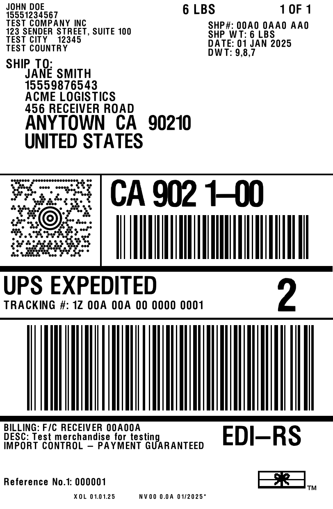

# go-zpl

A native Go library for generating, parsing, and rendering ZPL (Zebra Programming Language) commands for thermal label printers.



## Privacy

Everything runs locally - there are no servers or external API calls. The library runs in your application, the CLI processes files on your machine, and the [web demo](https://stirlingmarketinggroup.github.io/go-zpl/) uses WebAssembly to render entirely in-browser.

## Features

- Native ZPL generation without external dependencies
- No reliance on web services (Labelary, etc.)
- Builder pattern for constructing labels
- Implements standard Go interfaces (`fmt.Stringer`, `io.WriterTo`, `encoding.TextMarshaler`)
- Support for common ZPL elements:
  - Text fields with fonts and positioning
  - Barcodes (Code 128, Code 39, QR codes, DataMatrix, PDF417, MaxiCode, EAN-13, UPC-A, etc.)
  - Graphics (boxes, circles, ellipses, diagonal lines)
  - Field blocks and text formatting
- **ZPL parsing** - Parse existing ZPL strings into Label objects
- **Multi-page labels** - Parse and render ZPL with multiple labels (e.g., USPS APO continuation sheets)
- **Local rendering** - Render labels to PNG images without external services

## Installation

### Library

```bash
go get github.com/StirlingMarketingGroup/go-zpl
```

### CLI Tool

```bash
go install github.com/StirlingMarketingGroup/go-zpl/cmd/zplrender@latest
```

### Rust ([crates.io](https://crates.io/crates/zpl-rs))

```toml
[dependencies]
zpl-rs = "0.1"
```

```rust
let png_bytes = zpl_rs::render("^XA^FO50,50^A0N,30,30^FDHello!^FS^XZ")?;
```

### C/C++/Other Languages

Pre-built shared libraries (`libzpl`) are available for FFI integration. See [releases](https://github.com/StirlingMarketingGroup/go-zpl/releases) for downloads and [`cmd/libzpl`](cmd/libzpl/) for documentation.

## CLI Usage

```bash
# Convert ZPL file to PNG
zplrender label.zpl

# Specify output filename
zplrender -o output.png label.zpl

# Render at 300 DPI
zplrender -dpi 300 label.zpl

# Output as JPEG
zplrender -format jpeg label.zpl

# Read from stdin
cat label.zpl | zplrender -o output.png

# Show all options
zplrender -help
```

## Quick Start

```go
package main

import (
    "fmt"

    "github.com/StirlingMarketingGroup/go-zpl"
)

func main() {
    label := zpl.NewLabel().
        SetDPI(zpl.DPI203).
        SetSize(4, 6, zpl.UnitInches).
        TextField(50, 50, zpl.Font0, 30, 30, "Hello, World!").
        Code128(50, 150, "123456789", 100).
        QRCode(50, 300, "https://example.com", 5)

    fmt.Println(label)
}
```

Output:
```
^XA
^PW812
^LL1218
^FO50,50
^A0N,30,30
^FDHello, World!^FS
^FO50,150
^BCN,100,Y,N,N,N^FD123456789^FS
^FO50,300
^BQN,2,5^FDMA,https://example.com^FS
^XZ
```

## API Overview

### Creating Labels

```go
// Create a new label with builder pattern
label := zpl.NewLabel().
    SetDPI(zpl.DPI203).           // Set printer DPI (203, 300, or 600)
    SetSize(4, 6, zpl.UnitInches) // Set label size
```

### Adding Text

```go
// Simple text field
label.TextField(x, y, zpl.Font0, height, width, "Your text")

// Text block with wrapping
label.TextBlock(x, y, zpl.Font0, height, width, blockWidth, maxLines, zpl.JustifyCenter, "Long text...")

// Using unit conversion
label.TextFieldAt(0.5, 0.5, zpl.UnitInches, zpl.Font0, 30, 30, "Text")
```

### Adding Barcodes

```go
// Code 128
label.Code128(x, y, "data", height)

// Code 39
label.Code39(x, y, "DATA", height)

// QR Code
label.QRCode(x, y, "data", magnification)

// DataMatrix
label.DataMatrix(x, y, "data", moduleSize)

// PDF417
label.PDF417(x, y, "data", height)

// EAN-13
label.EAN13(x, y, "5901234123457", height)

// UPC-A
label.UPCA(x, y, "012345678905", height)
```

### Adding Graphics

```go
// Box/Rectangle
label.Box(x, y, width, height, thickness)

// Filled box
label.FilledBox(x, y, width, height)

// Horizontal line
label.HorizontalLine(x, y, length, thickness)

// Vertical line
label.VerticalLine(x, y, length, thickness)

// Circle
label.Circle(x, y, diameter, thickness)
```

### Low-Level API

For more control, use the command objects directly:

```go
label.Add(zpl.NewFieldOrigin(100, 200)).
    Add(zpl.NewScalableFont(zpl.FontE, 50, 40).WithOrientation(zpl.OrientationRotated90)).
    Add(zpl.NewFieldData("Rotated Text"))
```

### Output

```go
// Get ZPL as string
zplString := label.String()

// Get ZPL as bytes
zplBytes := label.Bytes()

// Write to io.Writer
label.WriteTo(writer)

// Marshal as text
text, err := label.MarshalText()
```

### Parsing ZPL

```go
import "github.com/StirlingMarketingGroup/go-zpl"

zplString := `^XA
^FO50,50^A0N,30,30^FDHello World^FS
^FO50,100^BQN,2,5^FDMA,https://example.com^FS
^XZ`

label, err := zpl.Parse(zplString)
if err != nil {
    log.Fatal(err)
}

// Work with the parsed label
fmt.Printf("Label has %d commands\n", len(label.Commands()))

// For multi-page ZPL (multiple ^XA...^XZ blocks), use ParseAll:
labels, err := zpl.ParseAll(multiPageZPL)
if err != nil {
    log.Fatal(err)
}
fmt.Printf("Parsed %d labels\n", len(labels))
```

### Rendering to Images

```go
import (
    "os"
    "github.com/StirlingMarketingGroup/go-zpl"
    "github.com/StirlingMarketingGroup/go-zpl/render"
)

// Create or parse a label
label := zpl.NewLabel().
    SetDPI(zpl.DPI203).
    SetSize(4, 6, zpl.UnitInches).
    TextField(50, 50, zpl.Font0, 30, 30, "Hello, World!").
    QRCode(50, 100, "https://example.com", 5)

// Create a renderer
renderer := render.New(zpl.DPI203).WithSize(812, 1218)

// Render to PNG file
f, _ := os.Create("label.png")
defer f.Close()
renderer.RenderPNG(label, f)
```

## Supported Commands

### Label Control
- `^XA` / `^XZ` - Start/end format
- `^PW` - Print width
- `^LL` - Label length
- `^LH` - Label home
- `^PO` - Print orientation
- `^PQ` - Print quantity

### Text & Fonts
- `^A` - Scalable/bitmapped fonts
- `^CF` - Change default font
- `^CI` - Character set
- `^FB` - Field block (text wrapping)
- `^FO` - Field origin
- `^FT` - Field typeset
- `^FD` / `^FS` - Field data / separator
- `^FR` - Field reverse

### Barcodes
- `^BC` - Code 128
- `^B3` - Code 39
- `^BQ` - QR Code
- `^BX` - DataMatrix
- `^B7` - PDF417
- `^BD` - MaxiCode
- `^BE` - EAN-13
- `^BU` - UPC-A
- `^B2` - Interleaved 2 of 5
- `^BY` - Barcode defaults

### Graphics
- `^GB` - Graphic box
- `^GC` - Graphic circle
- `^GD` - Graphic diagonal line
- `^GE` - Graphic ellipse
- `^GS` - Graphic symbol

## License

MIT
